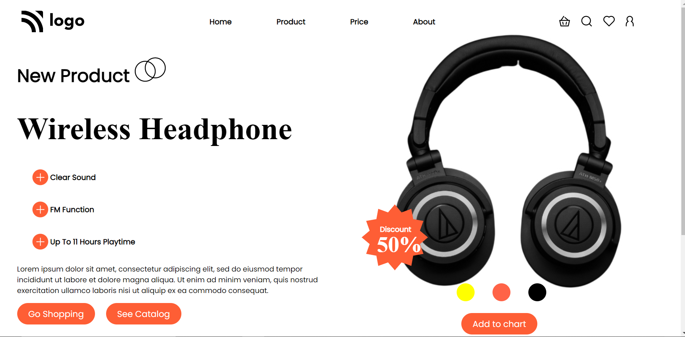
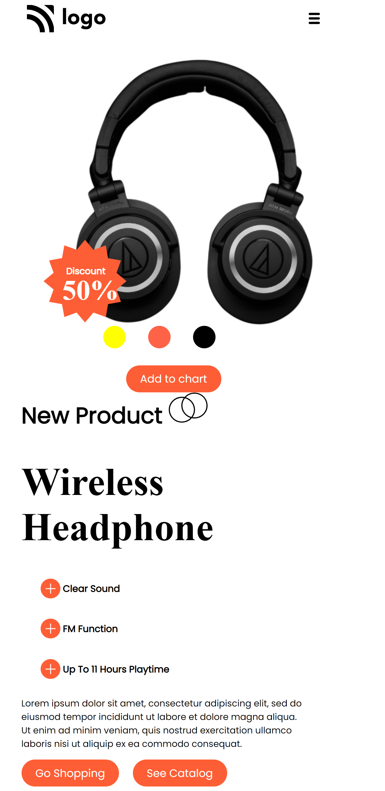

# Hello I am **Devang** and Welcome to **Product Landing Page**.

## 💻 Tech Stack Used :

  

 

 ## Project Name : Product Landing Page !

 

For the first time I have used **media query** in my project and it works for devices of screen widht below **600px** . This project made me comfortable using media query, this project is a result of reading 5-6 articles about media query. 

 

 ## Time for completion: 12 hrs 
 

For devices width below 600px this looks like as follows

### Do Check it Live on Below Link :

[Live Link !](https://productt-page.netlify.app/)
